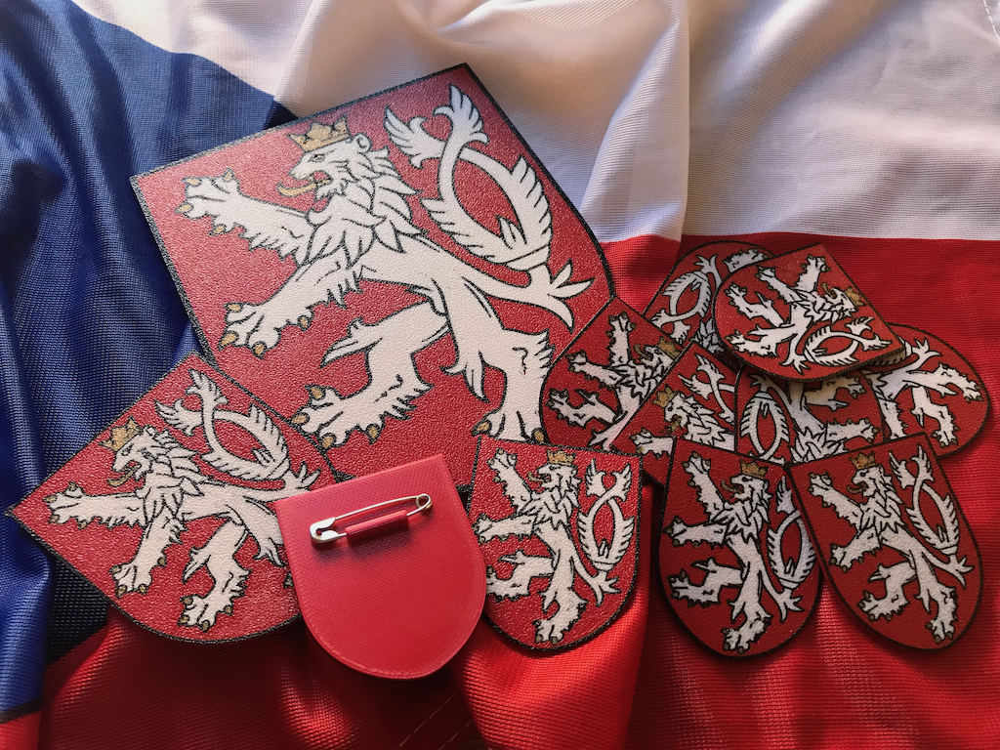

# 3D tisknutelný malý státní znak

Připomeňte si sté výročí vzniku státu a vytiskněte si odznak s malým státním znakem.

Pro tisk budete potřebovat zavírací špendlík a čtyři barvy filamentu: bílou/stříbrnou, zlatou, červenou a červenou

Barevný motiv se tiskne rovnou na podložku nejlépe ve dvou vrstvách. Pak několik vrstev červené na zpevnění a nakonec tiskneme uchycení zavíracího špendlíku.

Můžete si také vytisknout větší znak bez špendlíku.

V archivu naleznete soubory pro tisk odznaku výšky 5 cm a znaků vysokých 7 cm a 15 cm.

* Doporučený filament: PLA
* Doporučená výška vrstvy: 0.2 mm
* Doporučená podložka: Průša textured

## Jak připravit model k tisku?

Pokud máte tiskárnu Prusa MK3 nebo MK25, můžete použít připravené GCODE soubory a pokračovat částí [Jak vytisknout](#jak-tisknout)

Jinak si musíte poskládat model sami. Bohužel Slic3r neumí tak složité zadání z příkazové řádky, takže si musíte vše vyklikat ručně podle následujícího postupu pro Slic3r:

* Nastavení tiskárny -> Obecné -> Možnosti -> Extruder: 5
* Nastavení tiskárny -> Obecné -> Možnosti -> MultiMaterial tisk s jedním extruderem: ANO
* Nastavení tiskárny -> Vlastní G-code -> G-code pro výměnu nástoroje: M600
* Nastavení tisku -> Vrstvy a perimetry -> Detekovat tenké zdi: ANO
* Nastavení tisku -> Multiple extruders -> Čistící věž -> Zapnout: NE
* Podložka -> Přidat: soubor output/red
* Klikněte na soubor
* Nastavení
* Load modifier -> přidejte ostatní soubory v pořadí gold, black, white
* Pomocí šipek dopravte red na konec seznamu (pořadí gold, black, white, red)
* Postupně nastavte u každého souboru Extuders:
  * gold: 1
  * black: 2
  * white: 3
  * red: 4

Pokud tisknete odznak:
Pomocí Load modifer přidejte soubor "spendlik", posuňte ho na konec seznamu a nastavte mu extruder 5.

Otočte model o 180° kolem osy Y, aby lev byl na podložce a byl zrcadlově otočený.

## Jak tisknout?

Nastavte dorovnání osy Z o něco níže než obvykle, aby se první vrstva na podložce hezky slila.

Zaveďte zlatou strunu a spusťe tisk. Postupně budete vyzváni k výměně strun a postupujte v tomto pořadí:

2. černá
3. bílá
4. červená
5. zlatá
6. černá
7. bílá
8. červená

Pokud tisknete odznak, tiskárna se nyní zastaví a čeká na výměnu struny. Tento krok ale využijeme na výměnu barvy, ale na vložení špendlíku. Opatrně vložte neotevírací část špendlíku do vytištěné drážky a dejte pozor, aby žádná část špendlíku nebyla výše, než je nejvyšší vrstva tisku. Zasuňte znovu červený filament a zatiskněte špendlík do modelu.

## Jak byl model vytvořen?

Autorem zdrojového dokumentu s vektorovým znakem je [tvurce.eu] (https://tvurce.eu/design-system-cr/statni-symboly-ceske-republiky-v-krivkach-ke-stazeni/)

Z tohoto PDF jsem pomocí slučování a odčítání objektů ve vektorovém grafickém programu extrahoval vrstvy pro všechny čtyři barvy ve formátu svg.
SVG jsem pak po jednom nahrával do aplikace [Tinkercad](https://www.tinkercad.com/) a hned exportoval do STL.
Tyto STL jsem importoval v programu OpenSCAD, kde jsou upravovány na požadovanou velikost, kompletovány a opět exportovány do STL podle barev.

## Jak upravit model?

Pro snadnou parametrizaci jsem použil Customizer, který není možné využít na thingiverse, protože tam neumí import externích souborů, ale s OpenSCADem funguje výborně:

### ručně:
1. stáhněte si repositář
2. otevřete soubor .scad
3. upravte parametry, vygenerujte STL pro jednotlivé barvy

### poloautomaticky:
1. stáhněte si repositář
2. otevřete soubor .json
3. upravte parametry
4. spusťe skript generate.sh

## Autor

Jiří Kubíček
